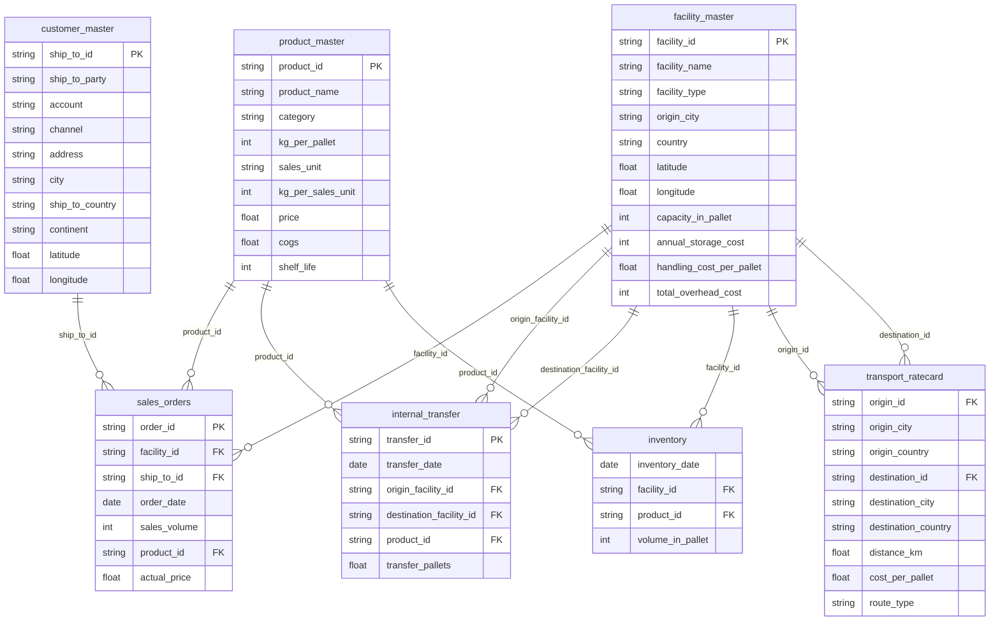

# Supply Chain P&L — Technical Documentation

Data warehouse + transformation layer for EU dairy supply chain P&L, built on **BigQuery** + **dbt Core**.

---

## Stack

- **Warehouse:** BigQuery
- **Transformation:** dbt Core 1.12 (`dbt-bigquery`)
- **BI:** Looker Studio

---

## Data Model

**Sources** (`raw_supply_chain`): `facility_master`, `customer_master`, `product_master`, `transport_ratecard`, `sales_orders`, `internal_transfer`, `inventory`

**Staging** (`models/staging/`) — 1:1 views, renamed to snake_case, no logic.

**Intermediate** (`models/intermediate/`):

| Model | Purpose |
|---|---|
| `int_facility_inventory_alloc` | Weekly inventory rounded up to whole pallets → averaged per facility/product → allocates storage/overhead/IOC by inventory share |
| `int_transfer_costs` | Internal transfers + rate card + origin handling cost |
| `int_outbound_totals` | Total volume leaving each facility (sales + transfers) |
| `int_inbound_inherited_costs` | Transport/handling/storage/overhead/IOC inherited by receiving facility from inbound transfers |
| `int_facility_cost_pool` | Combines direct + inherited costs into one pool per facility/product |

**Marts** (`models/marts/`): `fct_sales_pnl` — 1 row per sales order (~200k rows), table.

### Entity Relationship Diagram (raw sources)



---

## Calculation Logic

**Allocation ratio** (single ratio, applied to all cost types):
```
alloc_ratio = order.sales_volume_kg / facility_product.total_sales_volume_kg
```

**Cost pool per facility/product** = direct cost + inherited cost:
| Cost type | Direct | Inherited (from inbound transfers) |
|---|---|---|
| Storage + Overhead | own allocated share (by avg inventory) | pushed down from origin facility |
| IOC | 10% × avg inventory × COGS/pallet | pushed down from origin facility |
| Transport | outbound to customer | inbound transfer cost |
| Handling | outbound to customer | inbound (origin pick/load) |

**Order-level cost** = `cost_pool × alloc_ratio`

**Waterfall:**
```
GM     = Sales Value − COGS
CBM    = GM − (Transport + Handling + Storage/Overhead)
CBMAI  = CBM − IOC
SG&A   = 3.5% × Sales Value
EBITAI = CBMAI − SG&A
```

**Key decisions:**
- Inventory pallets rounded up (`CEIL`) *before* averaging — partial pallets can't be shared across SKUs.
- Single allocation ratio (sales volume only) used for all cost types — avoids splitting direct vs. inherited allocation logic.
- SG&A fixed at 3.5% (assumption).

---

## Setup

```bash
conda create -n dbt-env python=3.11 -y
conda activate dbt-env
pip install dbt-bigquery
gcloud auth login
gcloud auth application-default login
```

`~/.dbt/profiles.yml`:
```yaml
supply_chain_pnl:
  target: dev
  outputs:
    dev:
      type: bigquery
      method: oauth
      project: <gcp-project-id>
      dataset: dbt_dev
      threads: 4
      location: EU
```

> `raw_supply_chain` and `dbt_dev` must be in the **same BigQuery location**.

```bash
cd supply_chain_pnl
dbt debug
dbt run --select +fct_sales_pnl
dbt test
```

---

## Data Quality Checks

- `unique` / `not_null` on natural keys (staging layer)
- Waterfall reconciles: `EBITAI = CBMAI − SG&A`
- No negative cost values
- Allocation ratios sum to 1.0 per facility/product